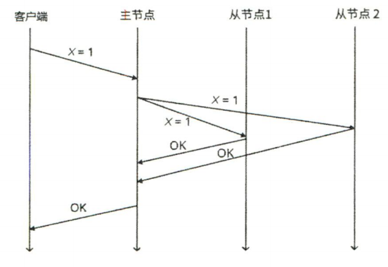
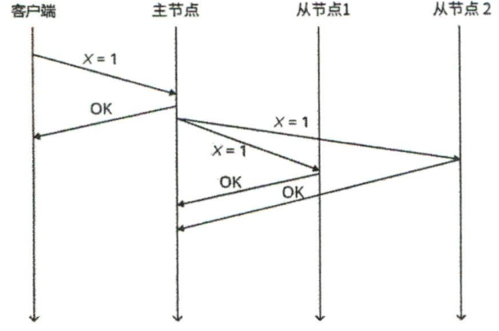
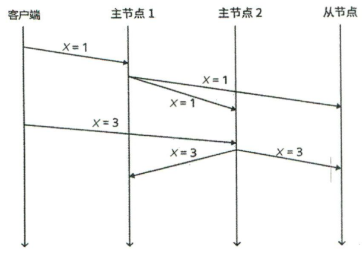

# 第一章
Why we need？
以前我理解分布式系统只是简单的认为其作用是分散单机压力，而实际上是肤浅的，分布式系统有以下特点：
1. 扩展性：现在大量数据密集型计算，而对于单机，当数据量增大到一定程度时，单机就无法扩展了，此时，需要分布式来扩展存储节点
2. 可用性：多节点的存在，使得系统可以在规定数量节点宕机的情况下仍然保持提供正常服务。5个 9 的可用性。
3. 高性能：现如今计算机发展早已突破摩尔定律的限制，单机性能不够时，我们可以往上堆料，但是单机的性能仍然是有上限的，而分布式可以简单的拓展系统中的计算节点，从而实现性能的扩展。
4. 必要性：对于一些天然的场景，生来就是分布式系统，比如说跨行转账，两个行的数据库形成了天然的数据隔离，此时，需要分布式系统设计来保证这个场景下的安全。
# 第二章
**两将军问题**和**拜占庭将军**问题所引出的分布式难题！
在分布式系统中：**节点是不可靠的，因为节点会宕机**；**网络是不可靠的，因为网络可能会延迟到达、不到达以及重复到达**；**时钟是不可靠的，因为多个节点之间的时钟难以同步**。
# 第三章
	分布式数据基础
现在大多业务都是数据密集型业务，从单机扩展到分布式的数据存储，既然有存储备份，就会有复制的概念
## 复制
	Why we need replica？
假设系统中目前存在三个节点，为了保证三节点的一致性，replica 就是必然的，这里涉及到了三种复制模型。
### 单主复制
	单主复制是比较简单的模型，例如之前实现的 Raft 就是单主复制模型，对于单主复制，又分为以下两个类型
1. 同步复制：同步复制是指主节点在收到客户端日志后，将日志复制给从节点后，再确认其复制成功后，再将此次请求视为一次成功的请求，最后返回给客户端

2. 异步复制：异步复制是指主节点在收到客户端日志后，在本机上完成操作后，立刻响应客户端，至于日志复制，则由后台异步发送给从节点

上面两种复制方式分别代表了可靠性和效率。
当实现同步的单主复制系统时，一次客户端请求可能会带来较高的延迟，因为需要所有的从节点响应后，才算一次完整的请求。
而异步的方式，虽然能极快的响应客户端请求，但是却无法确保从节点都复制了日志，例如上图，如果两个从节点都无法完成正常的复制，而主节点确正常响应了客户端请求，那么会大大降低系统的可用性。
#### 单主复制的优缺点
**优点**：
1. 单主复制系统设计简单，容易理解
2. 单主复制的系统，友好高读低写场景，可以将读请求分散到其余从节点上，即使从节点压力过大，单主复制系统也易于扩展
3. 由于其他节点并不处理写请求，只有 Leader 需要考虑并发请求，因此只要 Leader 保证自己的操作顺序，则其他节点亦能保证

**缺点**：
1. 不难发现，单主复制只有 One Leader，当 Leader 节点宕机后，整个系统会陷入不可用的状态，这个不可用的时长和选主 or Leader恢复时长紧密相关
2. 单主复制的写请求只由 Leader 节点来承担，所以写请求的性能瓶颈由 Leader 节点决定
### 多主复制
	既然单主写拉跨，那就也由多个节点来承担写请求

多主复制系统在一定程度上分散了写请求的压力，但是不难看出，系统是容易出现不一致的。
	eg. 例如上图，按照图示，整个系统最后的 x 值应该为3，但是我们设想一种情况，当 x = 1 的日志复制给主节点 1 和主节点 2 后，从节点的 x = 1 请求由于网络延迟还在路上，此时主节点 2 发起了 x = 3 的请求，这个请求成功的复制到了所有节点，次后，x = 1 的请求由来到了从节点上，导致两个主节点 x = 3，从节点 x  = 1。此时系统产生不一致性。
通过上面的例子，我们不难发现，多主分布式系统要解决的第一个难题就是数据冲突（虽然单主也会发生数据冲突，但易于解决）
#### 常见的数据冲突解决方案：
1. **客户端解决冲突**
2. **最后写入胜利**
3. **因果关系跟踪**
#### 多主复制的优缺点
**优点**：
1. 增加了 Leader 的容错性，容许部分 Leader 宕机
2. 分散写请求压力
3. 客户端可以选择就近（地理）的 Leader 写入，降低延迟

**缺点**：
1. 数据冲突难以解决
2. 实现复杂度远高系统优势
### 无主复制
...